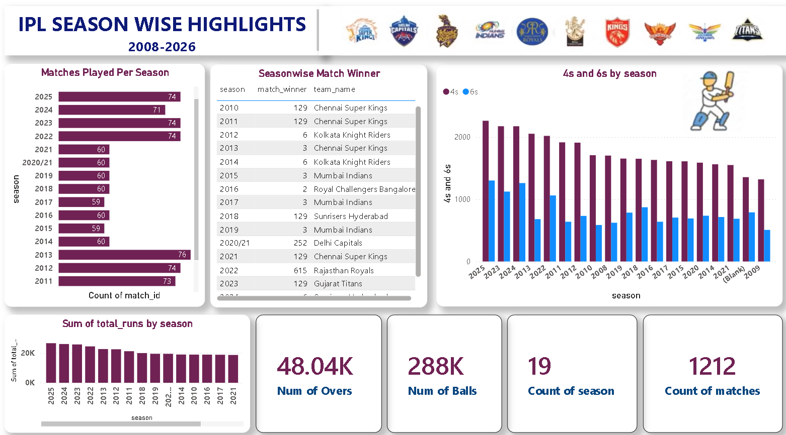

# 🏏 IPL Performance Analytics Dashboard (2008–2026)

> An end-to-end Business Intelligence project analyzing **1,200+ real IPL matches** and **288,000+ ball-by-ball deliveries** across 19 seasons — built with **Microsoft Power BI** and a connected, multi-table Kaggle dataset.

---

[](Images/Dashboard.png)

[](Images/Dashboard%202.png)


## 🚀 Project Overview

This project simulates a real-world sports analytics assignment. Using match, player, and ball-by-ball data spanning every IPL season since 2008, I designed an interactive two-page Power BI dashboard that turns raw cricket data into a clear, explorable story — covering team performance, toss impact, venue trends, and how the league's scoring style has evolved over nearly two decades.

The goal: answer the kind of questions a fan, analyst, or franchise strategist would actually ask — not just display charts for the sake of it.

🔗 **[View the live dashboard](https://app.powerbi.com/view?r=eyJrIjoiYzliY2Y2OTctMDNkOC00MmI3LWJmYmEtNzM3MzFjMmU1NjIzIiwidCI6ImUxNGU3M2ViLTUyNTEtNDM4OC04ZDY3LThmOWYyZTJkNWE0NiIsImMiOjEwfQ%3D%3D
)** — 

---

## 📊 Dataset Summary

| Attribute | Detail |
|---|---|
| **Source** | [IPL Seasons 2008 to 2025 Dataset](https://www.kaggle.com/datasets/slidescope/ipl-seasons-2008-to-2025-dataset) — Kaggle |
| **Total Matches** | 1,212 |
| **Total Deliveries** | 288,226 |
| **Total Seasons** | 19 (2008–2026) |
| **Venues Covered** | 59, across 38 cities |
| **Total Runs Scored** | 370,266 |
| **Tables** | `ipl_matches_data`, `ball_by_ball_data`, `players-data-updated`, `teams_data`, `team_aliases`, `IPL_finals` |

### 🗂️ Schema (core tables)

**`ipl_matches_data`**

| Column | Type | Description |
|---|---|---|
| `match_id` | Integer | Unique match identifier |
| `season` | Text | IPL season (e.g. 2023, 2020/21) |
| `team1`, `team2` | Integer (FK → teams_data) | Teams competing |
| `toss_winner`, `toss_decision` | Integer / Text | Toss outcome and decision |
| `match_winner` | Integer (FK → teams_data) | Winning team |
| `venue`, `city` | Text | Match location |
| `player_of_match` | Integer (FK → players-data-updated) | Match award winner |
| `win_by_runs`, `win_by_wickets` | Integer | Victory margin |

**`ball_by_ball_data`**

| Column | Type | Description |
|---|---|---|
| `match_id` | Integer (FK → ipl_matches_data) | Links delivery to its match |
| `batter`, `bowler`, `non_striker` | Integer | Players involved in the delivery |
| `batter_runs`, `total_runs`, `extras` | Integer | Runs scored off the delivery |
| `is_wicket`, `wicket_kind` | Boolean / Text | Dismissal detail |
| `over_number`, `ball_number` | Integer | Delivery position within the innings |

---

## 🔗 Data Tables & Relationships

| Table | Role |
|---|---|
| **ipl_matches_data** | Central fact table — one row per match |
| **ball_by_ball_data** | Granular fact table — one row per delivery |
| **teams_data** | Lookup table for team names |
| **players-data-updated** | Lookup table for player names |
| **team_aliases** | Maps historically renamed franchises to a single team identity |
| **IPL_finals** | Flags which matches were season finals |

---

## 📈 Key Insights Uncovered

- **Mumbai Indians lead in total wins (155)**, but **Gujarat Titans have the best win percentage (60.9%)** despite being one of the newest franchises
- **AB de Villiers** holds the most Player of the Match awards (25), ahead of Chris Gayle (22) and Rohit Sharma (21)
- **Eden Gardens** has hosted the most matches (77) of any venue across IPL history
- **Sixes per season have nearly doubled since 2021** (687 → 1,302 in 2025), reflecting more aggressive batting — likely tied to the Impact Player rule introduced in 2023

---

## 🔧 Tools & Technologies

| Tool | Purpose |
|---|---|
| **Microsoft Power BI Desktop** | Dashboard design, data modelling, DAX measures |
| **Power Query (M Language)** | Data cleaning, type correction, team-alias mapping |
| **DAX** | KPI measures — boundary counts, over totals, final-match flags |

---

## 📐 Dashboard Features

- **KPI Cards** — Total Matches, Seasons, Players, Batter Runs, Fours, Sixes
- **Team Performance Charts** — Matches played and won by team, season-wise trends
- **Toss & Result Analysis** — Toss decision breakdown and its impact on outcomes
- **Player Leaderboard** — Top Player of the Match award winners
- **Venue & City Breakdown** — Matches hosted by venue and city
- **Slicers & Filters** — Season, Venue, City, Match Result, Batter, Team — fully interactive across both dashboard pages

---

## 📁 Project Structure

```
IPL-Performance-Analytics-Dashboard/
│
├── IPL_Analysis_Dashboard.pbix        # Power BI report file
├── Dataset/                           # Source CSV files from Kaggle
│   ├── ipl_matches_data.csv
│   ├── ball_by_ball_data.csv
│   ├── players-data-updated.csv
│   ├── teams_data.csv
│   ├── team_aliases.csv
│   └── IPL_finals.csv
├── Images/                            # Dashboard screenshots and team logos
├── Report/
│   ├── IPL_Project_Report.pdf        # Full project report (Pdf)
├── License                            
└── README.md
```

---

## 🧠 Skills Demonstrated

- **Data Modeling** — Built a connected star-schema linking matches, deliveries, teams, players, and finals
- **Data Cleaning** — Standardized team names via an alias table, handled missing values for tied/no-result matches
- **DAX Proficiency** — Wrote measures for boundary counts, over totals, and calculated columns like `IsFinal` and `LosingTeam`
- **Storytelling with Data** — Structured the dashboard to move from high-level KPIs to detailed, filterable breakdowns
- **Analytical Thinking** — Framed the analysis around real questions (team consistency, toss impact, scoring evolution) rather than charts for their own sake

---

## 🏃 How to Run

1. Clone or download this repository
2. Open `IPL_Analysis_Dashboard.pbix` in **Power BI Desktop** (free download from Microsoft)
3. If prompted, update the data source path to point to the CSV files in the `Dataset/` folder on your machine
4. Click **Refresh** — all visuals will load automatically

> **Note:** Power BI Desktop is free for Windows. No Power BI Pro license is required to view the `.pbix` file locally, and the published dashboard link above works in any browser.

---

## 👤 Author

**Aditya Kumar**
Data Analytics Student | Power BI · SQL · Python · Excel

📧 [adisatya9508@gmail.com]
🔗 [https://www.linkedin.com/in/aditya-kumar-459077322/]
💻 [https://github.com/kumaradi9508]

---

## 📌 Use Case

This project is ideal as a portfolio piece for roles or coursework in:

- Data Analytics
- Business Intelligence
- Sports Analytics
- Dashboard Design & Data Storytelling

---

## 🙏 Acknowledgements

Built as part of a summer internship / data analytics course project, under the guidance of **Sumit Kumar Mitthu** and **Harpreet Singh Bedi**.

---

*Built using publicly available IPL data for educational purposes.*
